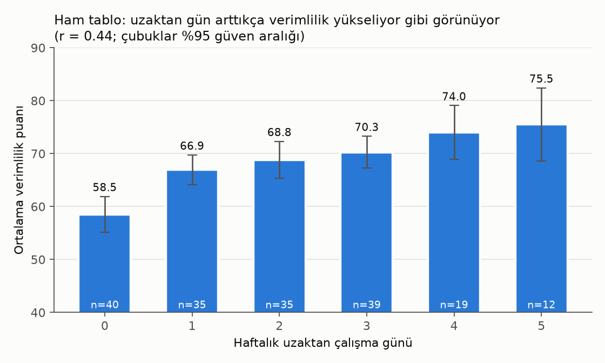
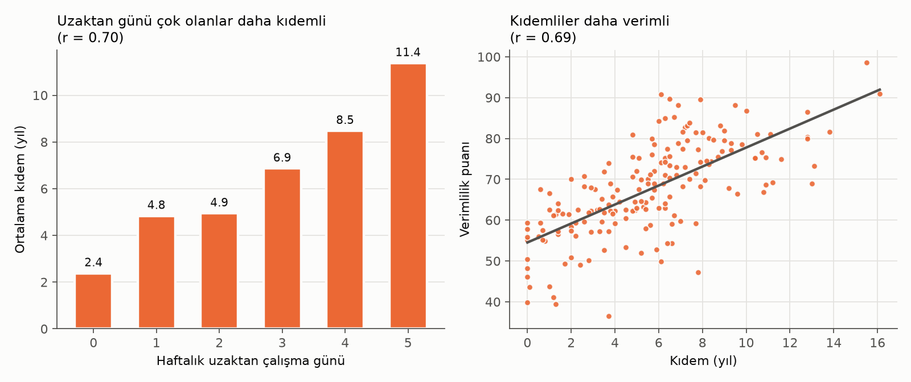
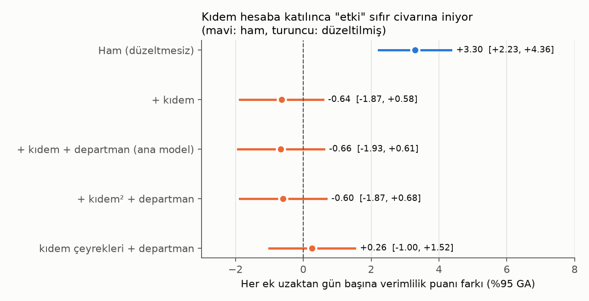

# Uzaktan Çalışma ve Verimlilik: Üç İddianın Doğrulanması

**Yönetim Kurulu için analiz raporu** · Tarih: 3 Ekim 2026
Veri: 180 çalışan (`calisan_verimlilik.csv`) · Analiz kodu: `analiz.py` · Tüm sayılar: `sonuclar.json`

---

## 1. Kısa cevap

**Taraflardan hiçbiri tam olarak haklı değil. Verilere en yakın olan İK, ama onun söylediği de fazla kesin.**

| İddia | Hüküm | Gerekçe (tek cümle) |
|---|---|---|
| **Genel müdür:** "Uzaktan çalışma verimliliği düşürüyor" | **Desteklenmiyor** | Ham veride tablo tersine dönüyor: uzaktan çalışanlar daha verimli. Kıdem hesaba katılınca kalan küçük negatif eğim istatistiksel olarak anlamlı değil (p = 0,31). |
| **Çalışanlar:** "Uzaktan çalışma verimliliğimizi artırıyor" | **Desteklenmiyor**: gözlem doğru ama yorum yanlış | Uzaktan çalışanlar gerçekten daha yüksek puan alıyor. Ancak bunun sebebi uzaktan çalışma değil, kıdem. Uzaktan çalışanlar daha kıdemli, kıdemliler de daha verimli. |
| **İK:** "Hiçbir ilişki yok" | **Kısmen doğru, fazla kesin** | Ham veride güçlü bir ilişki var (r = 0,44), yani "hiçbir ilişki yok" sözü yanlış. Kıdem sabit tutulduğunda anlamlı bir etki görülmüyor. Ancak "etki sıfır" da kanıtlanmış değil. |

**Kurula önerilen ifade:** *"Bu şirkette uzaktan çalışma ile verimlilik arasında görülen pozitif ilişki kıdemden kaynaklanıyor. Kıdem ve departman sabit tutulduğunda uzaktan çalışmanın verimliliği belirgin biçimde artırdığına ya da düşürdüğüne dair kanıt yok. Bloom çalışmasındaki gibi büyük bir artış bu veriyle uyumlu değil. Orta büyüklükte bir düşüş ise tamamen dışlanamıyor."*

---

## 2. Veride ne var?

- 180 çalışan, 4 departman (destek 48, satış 48, finans 45, yazılım 39). Eksik veya tekrarlı kayıt yok.
- Haftalık uzaktan gün 0–5, kıdem 0–16,1 yıl, verimlilik puanı 36,5–98,6 (ortalama 67,5).

### 2.1 Ham tablo: çalışanların gördüğü

| Uzaktan gün | n | Ort. verimlilik | Ort. kıdem (yıl) |
|---|---|---|---|
| 0 | 40 | 58,6 | 2,4 |
| 1 | 35 | 66,9 | 4,8 |
| 2 | 35 | 68,8 | 4,9 |
| 3 | 39 | 70,3 | 6,9 |
| 4 | 19 | 74,0 | 8,5 |
| 5 | 12 | 75,5 | 11,4 |

- Korelasyon r = 0,44 (%95 GA 0,31–0,55; p < 0,001). Her ek uzaktan gün ham olarak **+3,3 puan** ile birlikte görülüyor.
- 5 gün uzaktan çalışanlar, hiç uzaktan çalışmayanlardan ortalama **17 puan** daha yüksek.
- Bu ilişki dört departmanın **hepsinde** var (r = 0,42–0,51). Yani departman kaynaklı bir yanılsama değil.

### 2.2 Asıl etken: kıdem

- Kıdem ile uzaktan gün sayısı arasında **r = 0,70**. Kıdemliler daha çok uzaktan çalışıyor, büyük ihtimalle uzaktan çalışma hakkı kıdemle veriliyor.
- Kıdem ile verimlilik arasında **r = 0,69**. Kıdem tek başına verimlilikteki farkların %47'sini açıklıyor. Uzaktan gün sayısı tek başına yalnızca %19'unu açıklıyor.
- Kıdem ve departman sabit tutulduğunda uzaktan gün ile verimlilik arasındaki kısmi korelasyon **r = −0,08 (p = 0,26)**, yani pratikte sıfır.

### 2.3 Kıdem hesaba katılınca ne kalıyor?

Ana model: verimlilik ~ uzaktan gün + kıdem + departman (heteroskedastisiteye dayanıklı HC3 standart hatalar)

| Model | Ek uzaktan gün başına etki | %95 GA | p |
|---|---|---|---|
| Ham | +3,30 | +2,23 / +4,36 | < 0,001 |
| + kıdem | −0,64 | −1,87 / +0,58 | 0,30 |
| **+ kıdem + departman (ana)** | **−0,66** | **−1,93 / +0,61** | **0,31** |
| + kıdem² + departman | −0,60 | −1,87 / +0,68 | 0,36 |
| kıdem çeyrekleri + departman | +0,26 | −1,00 / +1,52 | 0,69 |
| Bootstrap (2000 tekrar, ana model) | −0,66 | −1,83 / +0,68 | n/a |

**Sağlamlık kontrolleri:**
- **Kıdem dilimleri ayrı ayrı (4 çeyrek):** Her dilimde uzaktan gün ile verimlilik ilişkisi sıfıra yakın ve anlamsız (r = −0,08 ile +0,18 arası, tüm p > 0,2).
- **Departman farkı:** Uzaktan çalışmanın etkisi departmanlar arasında farklılaşmıyor (etkileşim testi F = 0,004, p ≈ 1,0).
- **Etkinin büyüklüğü:** Güven aralığına göre en uç durumda, 0 günden 5 güne geçiş verimliliği **−9,6 ile +3,1 puan** arasında etkiler. Büyük bir artış dışlanıyor, orta büyüklükte bir düşüş dışlanamıyor.
- **Eşdeğerlik testi (TOST):** Etkinin "gün başına ±2 puandan küçük" olduğu gösterilebiliyor. "±1 puandan küçük" olduğu gösterilemiyor. Bu yüzden "hiç etki yok" demek için örneklem yetersiz.

**Dikkat edilecek ama aşırı yorumlanmaması gereken iki sinyal:**
- **Yazılım departmanı:** Departman içinde ayrı model kurulduğunda eğim −2,15/gün çıkıyor (p = 0,027). Ancak 4 departman ayrı ayrı test edildiği için anlamlılık eşiği 0,0125'e iniyor ve bu sonuç eşiği geçmiyor. Ortak modeldeki etkileşim testi de fark göstermiyor (p ≈ 1,0).
- **5 gün grubu:** Kıdem düzeltmesi sonrası 0 güne göre −6,8 puan (p = 0,06). Ancak bu grupta yalnızca 12 kişi var ve ortalama kıdemleri 11,4 yıl, yani kıdem dağılımının ucu. 9 yılın üzerinde kıdemi olanlarda 3, 4 ve 5 gün gruplarının ortalamaları neredeyse aynı (78,6 / 77,6 / 77,8).

---

## 3. İK'nın gönderdiği kaynaklar

### (a) Bloom, Liang, Roberts ve Ying (2015), *Quarterly Journal of Economics* 130(1): 165–218

**Atıf doğru.** Ctrip (Çin, 16.000 çalışanlı seyahat şirketi) çağrı merkezinde yapılmış bir rastgele deney. Evden çalışma performansı **%13 artırmış**: %9'u vardiya başına daha fazla çalışılan dakikadan (daha az mola ve hastalık izni), %4'ü dakika başına daha fazla çağrıdan geliyor. Çalışanların işten ayrılma oranı yarıya inmiş.

**Bu şirkete genellemeden önce bilinmesi gerekenler:**
- Katılımcılar **gönüllüydü**. Evden çalışmaya ilgi gösteren 503 kişiden şartları sağlayan (en az 6 ay kıdem, genişbant internet, evde ayrı oda) 249 kişi alındı.
- Haftada **4 gün** evden, ölçülmesi kolay ve **bireysel** bir iş (telefonla rezervasyon).
- Evden çalışanların, performansları aynı olsa bile **terfi olasılığı düştü**.
- Deneyden sonra çalışanlar kendileri seçebildiğinde kazanç %22'ye çıktı. Bu da **kimin uzaktan çalıştığının (seçilim)** sonucu ne kadar etkilediğini gösteriyor.

**Bu şirketin verisiyle karşılaştırma:** %13'lük artış bu şirketin ortalama puanına oranlanırsa haftada 4 gün için yaklaşık 8,8 puan, yani gün başına yaklaşık 2,2 puan eder. Bu şirkette düzeltilmiş etkinin üst sınırı gün başına +0,6. Bloom büyüklüğünde bir artış **bu şirketin verisiyle uyumlu değil** (puan ölçekleri farklı olduğu için bu karşılaştırma kabadır).

**Literatür tek yönlü değil:**
- Aynı yazarların hibrit çalışma (haftada 2 gün evden, 1.612 kişi) üzerine yaptığı daha yeni rastgele deney (Bloom, Han ve Liang, 2024, *Nature*): performansa **etki yok**, işten ayrılma üçte bir azalmış.
- Emanuel ve Harrington (2024, *AEJ: Applied*): ABD'de bir Fortune 500 şirketinin çağrı merkezinde uzaktan çalışanlar saatte %12 daha az çağrı yanıtlamış. Farkın bir kısmı uzaktan çalışmanın etkisi, büyük kısmı daha az verimli çalışanların uzaktan işleri seçmesi.

Sonuç: Etki işin türüne, haftalık gün sayısına ve kimin uzaktan çalıştığına bağlı. Tek bir çalışma "uzaktan çalışma verimliliği artırır" demeye yetmez.

### (b) 2023 iş dergisi haberi: "Yöneticilerin %60'ı uzaktan çalışanların daha az verimli olduğunu düşünüyor"

- Haberin künyesi verilmemiş. Rakam büyük ihtimalle **Owl Labs "State of Hybrid Work 2023"** anketinden geliyor (ABD, yaklaşık 2.050 tam zamanlı çalışan). Birincil kaynağı açamadım, eşleşme yalnızca arama sonuçlarına dayanıyor.
- Bu bir **algı anketi**, verimlilik ölçümü değil. Gösterdiği şey "yöneticiler böyle düşünüyor". Uzaktan çalışmanın verimliliği düşürdüğünü göstermiyor.
- Aynı ankette çalışanların **%62'si** uzaktan çalışırken kendini daha verimli hissettiğini söylüyor. Yani bu kaynak, şirketteki tartışmanın aynısını (yöneticiler ve çalışanlar) ölçüyor, kimin haklı olduğunu değil.
- Bloom ve ark. (2024) deneyinde yöneticilerin beklentisi deneyden önce −%2,6 iken, sonuçları gördükten sonra +%1,0'e dönmüş. Yönetici algısı gerçek sonuçlardan sapabiliyor.

---

## 4. İddialar birbiriyle uyuşuyor mu?

**İfade edildikleri haliyle hayır.** Üç iddia birbirini dışlıyor: biri düşüş (−), biri artış (+), biri sıfır (0) diyor. Aynı anda üçü birden doğru olamaz.

**Ancak her taraf farklı bir soruya cevap veriyor:**

| Taraf | Aslında neye bakıyor? | Bu veride ne bulundu? |
|---|---|---|
| Çalışanlar | Ham ilişki: "uzaktan çalışanlar daha verimli mi?" | **Evet** (+17 puan), ama bunun sebebi kıdem |
| İK | Düzeltilmiş ilişki: "aynı kıdemdeki iki kişiden uzaktan çalışan daha mı verimli?" | **Anlamlı fark yok** |
| Genel müdür | Algı: kaynak (b)'deki yönetici kanaatiyle aynı | Ölçülen veride **karşılığı yok** |

İK'nın iki kaynağı da birbiriyle çelişmiyor, çünkü farklı şeyleri ölçüyorlar: (a) gerçekleşen performansı, (b) yöneticilerin kanaatini. Ayrıca İK'nın gönderdiği (a) kaynağı, İK'nın kendi "hiç ilişki yok" iddiasını değil, çalışanların iddiasını destekliyor. Bu da İK'nın tutumunun kendi kaynaklarıyla tam uyuşmadığını gösteriyor.

---

## 5. Sınırlılıklar ve varsayımlar

1. **Gözlemsel, tek zamanlı veri.** Rastgele atama yok. Kıdem ve departman dışındaki etkenler (rol, yönetici, görev tipi, kişisel tercih) kontrol edilemedi.
2. **Ters nedensellik olasılığı.** Uzaktan çalışma hakkı yüksek performansa ödül olarak veriliyorsa, gerçek bir negatif etki gizlenmiş olabilir. Tersi de mümkün.
3. **Verimlilik puanının nasıl ölçüldüğü bilinmiyor.** Puan **yönetici değerlendirmesine** dayanıyorsa, (b) kaynağındaki yönetici önyargısını taşıyor olabilir. Varsayım: puan departmanlar arasında karşılaştırılabilir.
4. **Kıdemin karıştırıcı olduğu varsayıldı.** Uzaktan çalışma kıdemi değiştiremeyeceği için bu varsayım makul.
5. Örneklem (n = 180) büyük etkileri saptamaya yetiyor ama küçük etkileri (gün başına 1 puanın altı) ayırt etmeye yetmiyor.
6. Dış kaynaklar web araması ile teyit edildi. Yayıncı sayfalarına doğrudan erişim ağ kısıtlaması nedeniyle mümkün olmadı.

---

## 6. Kurula öneriler

1. **Ham korelasyona dayanarak politika kararı almayın.** "Uzaktan çalışanlar daha verimli" tablosu kıdemden kaynaklanıyor.
2. **Uzaktan çalışmayı kısıtlamak için de bu veride gerekçe yok.** Verimlilik düşüşüne dair anlamlı kanıt bulunmadı.
3. **Kesin cevap için şirket içi pilot yapın.** Bloom ve ark. (2024) tasarımına benzer şekilde: gönüllüler arasından, kıdeme göre tabakalı **rastgele** atama yapılsın, 6 ay hibrit (örneğin 2 gün) ile ofis karşılaştırılsın. Verimlilik yönetici puanı yerine **nesnel çıktı** ile ölçülsün. İşten ayrılma da izlensin.
4. **Yazılım departmanını ve tam uzaktan (5 gün) grubu izleyin.** İkisinde de zayıf negatif sinyal var ama kanıt sayılmaz.

---

### Kaynaklar
- Bloom, N., Liang, J., Roberts, J., Ying, Z. J. (2015). Does Working from Home Work? Evidence from a Chinese Experiment. *QJE* 130(1): 165–218. https://ideas.repec.org/a/oup/qjecon/v130y2015i1p165-218.html · https://www.nber.org/papers/w18871
- Bloom, N., Han, R., Liang, J. (2024). Hybrid working from home improves retention without damaging performance. *Nature* 630: 920–925. https://www.nature.com/articles/s41586-024-07500-2
- Emanuel, N., Harrington, E. (2024). Working Remotely? Selection, Treatment, and the Market for Remote Work. *AEJ: Applied* 16(4): 528–559. https://ideas.repec.org/a/aea/aejapp/v16y2024i4p528-59.html
- Owl Labs, State of Hybrid Work 2023. https://owllabs.eu/state-of-hybrid-work/2023 (%60 / %62 rakamları ikincil özetlerden alındı: https://pumble.com/learn/collaboration/remote-work-statistics/)
